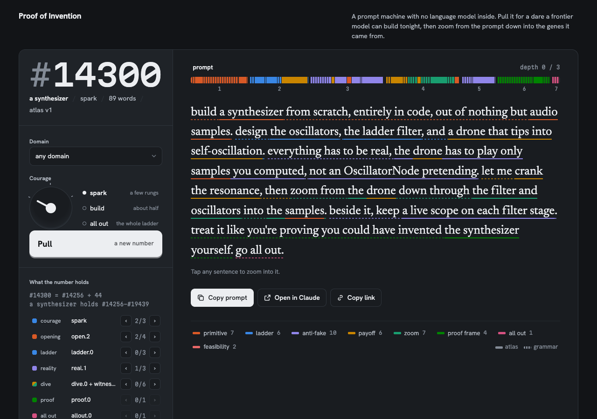
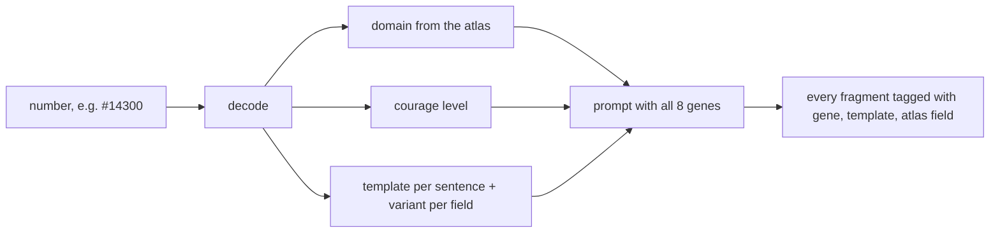

# Proof of Invention

A prompt machine with no language model inside: it turns a number into a build dare for a frontier model, and keeps an honest wall of the runs.

[](LICENSE)

**Open the machine:** https://neurabytelabs.github.io/proof-of-invention/



## Why

Good "build it from scratch" prompts are hard to write and easy to fake. This machine writes them from a fixed grammar and atlas instead of a model, so every prompt is reproducible from its number, every sentence can be traced to where it came from, and results are recorded only when a real run backs them.

## Quick start

Open the machine at the link above, or from a clone:

```bash
git clone https://github.com/neurabytelabs/proof-of-invention.git
cd proof-of-invention
open index.html                    # macOS; elsewhere open the file in any browser. index.html#1551 jumps to a number
node tools/selftest.cjs            # the page's self-test over all numbers (Node 18+, no dependencies)
node tools/samples.cjs             # list every domain with its number range
node tools/samples.cjs '#1551'     # one number, fragment by fragment, with its gene and source
```

## How it works

Pick a number and the machine writes one "impossible but real" build prompt. For example, `#14300`:

> build a synthesizer from scratch, entirely in code, out of nothing but audio samples. design the oscillators, the ladder filter, and a drone that tips into self-oscillation. everything has to be real, the drone has to play only samples you computed, not an OscillatorNode pretending. let me crank the resonance, then zoom from the drone down through the filter and oscillators into the samples. beside it, keep a live scope on each filter stage. treat it like you're proving you could have invented the synthesizer yourself. go all out.

No model writes these prompts. The machine is one HTML file with an engine, a grammar and an atlas:

- **8 genes.** Every prompt carries all of them: a primitive, a ladder of named layers, an anti-fake ban, a payoff you can use, a zoom from the payoff down to the primitive, a proof frame, "go all out", and feasibility (the ladder follows a path that textbooks and courses already teach).
- **48 domains in the atlas.** Each domain names its primitive, its ladder and the source the ladder follows, for example *The Elements of Computing Systems* for the computer. Domain 0 is the machine itself.
- **3 courage levels.** `spark`, `build` and `all out` use the same genes with a longer ladder and a bigger payoff.
- **Fixed numbers.** A number picks a domain, a level, a template for every sentence and a variant for every field. The same number gives the same prompt forever.
- **Traceable text.** Tap any sentence to see the gene, the template and the atlas field it came from, with the alternatives that a different number would have chosen.



There is no backend, no API key, no build step and no model at run time. The only network requests load web fonts; without them the page uses system fonts.

## Use it

1. Open the machine at the link above, or open `index.html` in a browser from a clone.
2. Pull a prompt, or add a number to the address, for example `index.html#1551`.
3. Copy the prompt and run it in a frontier model.
4. Add an honest card to the wall, whether the build worked or broke (see below).

`#0000` is the machine's own birth prompt, with the golden sample under it. `#1551` reproduces the golden sample word for word from the `computer` entry. The golden sample is a prompt the author came across in September 2026; its original author is not recorded here.

## The self-test

The page tests itself. Open `index.html#selftest` in a browser, or run it with Node:

```bash
node tools/selftest.cjs
```

It needs Node 18 or later and no dependencies. It checks all 214,704 numbers in a few seconds, including:

- every prompt carries all eight genes and stays in the word range for its level;
- every character belongs to a fragment that names its gene and its template or atlas field;
- `encode(decode(n)) = n` for every number, and every number gives a different prompt;
- a second, independently built engine re-renders every 97th number and gets the same text;
- version 1 still matches the published digest `6oyf7evfct`, so a one-word edit to any published prompt fails the test;
- the engine source has no randomness, clock, storage or network access.

CI runs the same command on every push and pull request.

To read prompts from the command line:

```bash
node tools/samples.cjs internet    # prompts of one domain at every level
node tools/samples.cjs '#1551'     # one number, fragment by fragment, with its gene and source
```

## The wall

The wall is the JSON block marked `THE WALL` in `index.html`. Each card is one real run of a pulled prompt: the number, the model, how long it took, a verdict on whether the anti-fake ban held (`held`, `partly` or `broken`) and a postmortem. Cards that broke stay on the wall.

Before this repository went public, every card was checked against a record of the run. No card was removed, because the only card has a source.

| Card | Run | Source checked |
|---|---|---|
| `#0000` (the machine) | Claude Opus 5.5 in Claude Code built this page from the `#0000` prompt and its contract, 2026-09-28, about six hours including a pause at a usage limit. | The Claude Code session log of the build. The model ID, the date, the time window and the events in the postmortem (the number-scheme rebuild after a code review, the rounds of skeptic readers, the Wireworld prompt cut to a decade counter) appear in that log. |

The verdict on this card is the builder's own and is backed by the self-test, not by an outside reviewer. The card says so.

**One run is not on the wall yet.** On 2026-09-28, prompt `#124809` (radio, all out) was run in Claude Cowork and produced *Radio from Samples*, published at https://proof.neurabytelabs.com/r/124809/ (source in `site/r/124809/`). The prompt text used for that run matches the machine's `#124809` word for word. It has no card because the model, the duration and the verdict were not recorded. A card will be added only with those three facts.

## Files

| Path | What it is |
|---|---|
| `index.html` | The machine: engine, grammar, atlas, self-test and wall in one file. |
| `tools/selftest.cjs` | Runs the page's self-test in Node. |
| `tools/samples.cjs` | Prints the prompts of a domain, or one number with the source of every fragment. |
| `docs/screenshot.png` | Screenshot of the machine at `#14300` used in this README. |
| `docs/atlas-authoring.md` | Rules for growing the atlas: append only, `since`, frozen version 1. |
| `prompts/meta-prompt-v1.md` | The prompt that built the machine (`#0000` plus its contract). |
| `docs/niyet-sozlesmesi-v1.md` | The intent contract behind the meta-prompt (Turkish). |
| `site/` | The static site at proof.neurabytelabs.com: a landing page and the `#124809` radio. |
| `deploy/` | Dockerfile and nginx config that serve `site/`. |

The GitHub Pages copy of the machine is published from `index.html` by `.github/workflows/pages.yml`.

## The rule that does not change

No published number ever changes its prompt. The atlas and the grammar grow only by appending: a new version number and entries marked `"since"`. New numbers start after the last old one. The self-test enforces this with the version 1 digest. Details are in `docs/atlas-authoring.md`.

## Status / limits

- Prototype. Version 1 of the atlas is frozen at 214,704 prompts.
- The machine writes prompts. It does not run them, and it cannot tell whether a model will succeed.
- Spark prompts are 81 to 115 words, above the 60 to 100 words the contract asked for, because all eight genes and a witness need the room.
- The wall has one card, and it is the machine's own build. Only one external run (`#124809`) exists so far.
- Feasibility is a design goal of the atlas, not a guarantee. Some all-out prompts may not finish in one session.

## Türkçe özet

Proof of Invention, içinde dil modeli olmayan bir prompt makinesi. Bir numarayı, öncü bir modele verilecek tek bir "imkânsız ama gerçek" inşa promptuna çevirir. Aynı numara her zaman aynı promptu verir. Her cümle, bir gene ve atlastaki bir kayda kadar izlenebilir. Duvar yalnızca gerçek koşuları gösterir; çalışanları da çökenleri de. Şu an duvarda tek kart var: makinenin kendi inşası. `#124809` numaralı radyo koşusu gerçek, ama model, süre ve hüküm kaydedilmediği için duvarda kartı yok.

## License

MIT. See [LICENSE](LICENSE). © 2026 Mustafa Saraç
